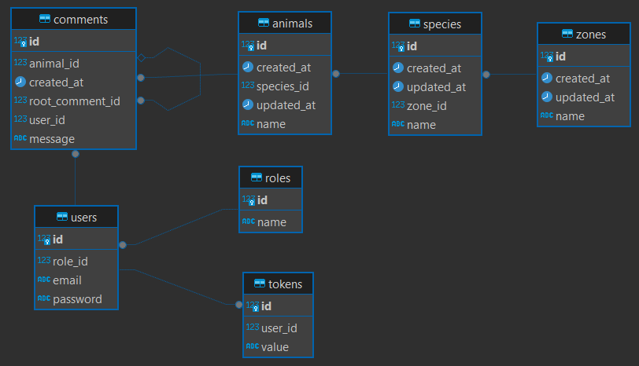
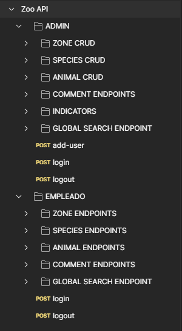

## Backend Technical Challenge: ZOO CRUD with Authentication by JWT
## Table of Contents
1. [Description](#description)
2. [Technologies](#technologies)
3. [Entity-relationship model](#entity-relationship-model)
4. [Installation and Usage](#installation-and-usage)

___
### Description: 

This REST API allows the comprehensive management and control of a zoo, offering functionalities to create users with specific roles, manage information about zones, species and animals, and facilitate interaction between users through comments.

The API uses Spring Security and JWT Token to manage an access control system by role (ADMIN and EMPLOYEE) using a token that expires at a time determined by the application.properties file.
___
### Technologies:
- [Java (JDK 17)](https://www.oracle.com/co/java/technologies/javase/jdk17-archive-downloads.html "Java JDK 17") : Minimum Java jdk version to use the API is 17.
- [Apache Maven](https://maven.apache.org/download.cgi "Apache Maven"):  Apache Maven is required to use the API.

|Backend|
|---|
|      |

___
### Entity-relationship model:



___

### Installation and Usage:

1. Clone the ZOO CRUD project repository

Open the terminal and type the following command to download the Parking CRUD project 

```sh
git clone https://github.com/BrayanGuerreroXD/zoo-crud-spring-boot.git
```

This project in the resources folder has a sql file called import.sql, which has the script to insert the two roles needed in the flow and in turn loads the admin user. This file contains the following.

```sql
-- Insert roles
INSERT INTO roles(name) VALUES('ADMIN');
INSERT INTO roles(name) VALUES('EMPLEADO');
-- Insert admin user
INSERT INTO users(email, password, role_id) VALUES ('admin@mail.com', '$2a$10$WHA7Rwnti3PLuYZlaxY/zORWt0awaMWoxaKv0pFphGntI3oLDqXU2', 1);
```

3. Add environment variables in application.properties in the ZOO CRUD project.

The application.properties of the ZOO CRUD project looks as follows:

```properties
server.port=8081

#----- JWT DATA
jwt.secret.key=${JWT_SECRET_KEY}

#----- EXPIRATION TIME PER TOKEN
jwt.expiration.time=${TIME_IN_MILLISECONDS}

# ----- NUMBER OF SESSIONS PER USER
number.sessions=${NUMBER_OF_SESSIONS}

server.error.include-message=always

spring.jpa.properties.hibernate.dialect = org.hibernate.dialect.PostgreSQLDialect

spring.jpa.hibernate.ddl-auto=create
# spring.jpa.hibernate.ddl-auto=update
spring.jpa.hibernate.show-sql=true

spring.datasource.url=jdbc:postgresql://${DATABASE_URL}
spring.datasource.username=${DATABASE_USERNAME}
spring.datasource.password=${DATABASE_PASSWORD}

server.error.include-message=always
```

- JWT_SECRET_KEY: It is the secret key for the creation of the authorization tokens for each user login.
- TIME_IN_MILLISECONDS: It is the time in milliseconds for the expiration of the jwt token.
- NUMBER_OF_SESSIONS: It is the number of sessions per user
- DATABASE_URL: Is the url where your PostgreSQL database is running.
- DATABASE_USERNAME: Is your PostgreSQL username
- DATABASE_PASSWORD: Is your PostgreSQL password

The line "spring.jpa.hibernate.ddl-auto=create" in the first run of the project must be in CREATE to generate the tables and relationships of the project entities and in turn runs the script mentioned above. After doing the above, its status should be changed to UPDATE so that it only updates if necessary.

4. Test postman http request collection.

After both projects are running, it is time to test the http requests to determine the correct functioning of the API. The order of the Postman collection looks as follows:



To obtain the authorization token for the ADMIN user is with the Login request, this token is obtained and can be added to each of the other requests in the ADMIN directory in the Bearer Token of type Authorization.

Likewise with the EMPLEADO user, in his directory there is the request to obtain his authorization token so that he can use all the collection of requests of the EMPLEADO user.

___
